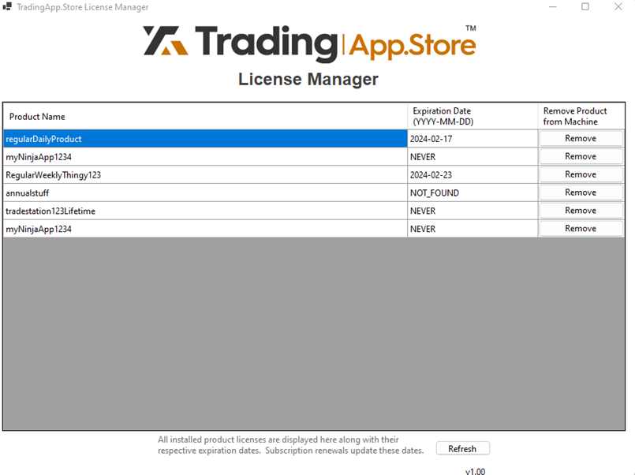

# TradingAppStoreExamples-NinjaTrader
## Description
TradingApp.Store offers a comprehensive software suite enabling vendors to verify user permissions for their products. The suite comprises digitally signed Dynamic Link Libraries (DLLs) containing API functions accessible via NinjaTrader scripts integrated into your software.

## Setup
Go to [vendors.tradingapp.store](https://vendors.tradingapp.store/app), create a vendor account, and click the 'Create Listing' button at the top right. Proceed to fill out the Product Listing form.  Instructions below.

### Product Name:
Fill out a Product Name at the top left and a SKU will be automatically produced at the bottom of the page (this will identify your product on our servers). 

### Product Description:
Create a formated product description in an editor like Word or Google Docs and then paste it into the Product Description text-box.  Read over it and do a final editing of the formatting to make sure it looks right.  The product description should fully explain your product, its features, benefits, and how it works.  Give as much detail as possible.  

### Images:
Add images and/or videos one at a time.  Most file common file types are accepted.  You can also use online videos from YouTube via the URL link.

### Listing Types:
Check all that apply to this product.  Your product may fit into more than one Listing Type.  

### Subscription Options:
Choose the type of billing scheme to use. Available options are: Lifetime, Annual, Monthly, Free Trial + Monthly, Free Trial + Annual, Free Trial + Lifetime.

### Webhook Link:
If you have a real-time listening application that works with Webhooks, paste the link to it here to be notified when a purchase for this product is made.

### Purchase Email:
If you would like email notifications upon purchases, place the receiving address here.

### Target Platform:
Choose NinjaTrader

### NinjaTrader Username
Enter your NinjaTrader Username. This value will be embedded into the license so that you can check it at runtime whenever you access our DLL.

### SKU:
Unique self-created product identifier that you will use in your script while accessing the DLL.

### Download MSI:
Press this to download a copy of the 'TradingApp.Store License Manager' that is master-keyed to this specific product and specifically to your NinjaTrader username.  This provides you, the Vendor, the ability to test the integrations of your products with our DLLs.  After installing this MSI, launch the TradingApp.Store license manager application to see the generated license.  


  

Your system is now ready for seamless integration with our platform.

## How it works
The DLL will automatically detect a license in the TradingAppStore/licenses folder and then will determine if the user has permission. If the license is expired, or a newer version of the license is required, then the DLL will automatically update the license to contain the new information. Consequently, users need only execute the installer once to access any trading apps or software included with their current or future purchases.
The TradingAppStore DLL also offers a hardware authorization option that only allows a certain number of devices to access one instance of your product. This adds an additional layer of security by preventing copies of a DLL / product from gaining permission.
You may download the installer for TradingAppStore from the vendor portal whenever you are in the process of creating a listing. All licenses created from the vendor portal are tagged with a “Debug” flag, so they will not have any functionality in release mode. Thus, BE SURE TO CHANGE THE DEBUG FLAG TO FALSE AFTER COMPLETION OF TESTING PHASES.

## Implementation
After downloading and executing the MSI installer, navigate to C:\ProgramData\TradingAppStore\x64 . Copy the TASDotNet.dll and Utils_DotNet.dll files and paste them into your Documents\NinjaTrader\bin\custom folder. Then, in your NinjaScript file, add those newly added files in the bin\custom folder as references to your project by right-clicking and selecting “references”.
To access the DLL function, the following lines can be inserted into your software source files:
```C#
using static Utils;
using static UserPermission;
using System.Text;
using System.Net.Http;

Print("Starting...");

//Before you use the dlls, you should first make sure that they have not
//  been tampered with.
if (!VerifyDlls())
{
    return; // VERY IMPORTANT: Handle the case for if either verification fails. Do not use the library code! In this example, we simply return to terminate the program.
}

UserPermission p = new UserPermission();
string productID = "INSERT_PRODUCT_SKU";
string customerID = "NinjaTrader-" + "GET_CUSTOMER_USERNAME";
bool debug = true; // VERY IMPORTANT: Only set this to true during testing. Actual implementation will have debug set to false.

//Perform user authentication using TAS authorization
int error_platform_auth = p.GetPlatformAuthorization(customerID, productID, debug);

if (error_platform_auth == 0)
{
    Print("Access granted");
}
else
{
    Print("Access denied. Error: " + error_platform_auth.ToString());
    return; // VERY IMPORTANT: Be sure to handle the case for when a user doesn't have access. In this example, we simply return to terminate the program.
}

private bool VerifyDlls()
{
    Utils utils = new Utils();

    //This gets a one-time-use magic number from a utility dll
    string magicNumber = utils.ReceiveMagicNumber();

    var jsonString = "{\"magic_number\" : \"" + magicNumber + "\"}";

    //Now, let's send that magic number to our server to be verified
    using (var client = new HttpClient())
    {
	var content = new StringContent(jsonString, Encoding.UTF8, "application/json");
	var response = client.PostAsync("https://tradingstoreapi.ngrok.app/verifyDLL", content).Result;

	if (response.StatusCode == System.Net.HttpStatusCode.OK)
	{
	    Print("DLL accepted"); //After verifying the DLLs, you can safely use them to authorize your customers.
	    return true;
	}
	else if (response.StatusCode == System.Net.HttpStatusCode.Unauthorized)
	{
	    Print("DLL has been tampered with.");
	    return false;
	}
	else
	{
	    Print($"Error: {response.StatusCode}");
	    return false;
	}
    }
}
```

Please make sure that the end user knows to copy the TAS_DotNet and Utils_DotNet DLLs into the Documents\NinjaTrader\bin\custom folder as well or else your application will throw an error.


## DLL Inputs
The DLL must have 3 input values:
* string customerID :   username of the user
* string productID :    SKU of the product to be checked.
* bool debug :          set to True if you are testing to use Debug licenses distributed by the vendor portal. SET TO FALSE FOR RELEASE OR ELSE ANYONE WILL HAVE ACCESS TO YOUR PRODUCT

## DLL Return Values
The DLL will return various error values based on numerous factors. It is up to your application how to handle them.
```
0 - no error
1 - expired
2 - wrong customerId
3 - cannot use Debug license in Release Mode
4 - invalid productId
5 - Too many user instances. Only for TAS Authorization. Contact support@tradingapp.store
6 - billing attempt not found... likely expired
8 - File Error
9 - other error
```

## Finishing Up
Go back to the Vendor Portal to complete your product setup.

### Upload Software Here:
Once your product is successfully integrated into our permissions system, take the product out of debug mode (see bool debug above), and export your project.  We recommend using NinjaTrader's Instructions here:  https://ninjatrader.com/support/helpGuides/nt8/NT%20HelpGuide%20English.html?distribution_procedure.htm
If you have accompanying files, workspaces, symbol lists, etc, it is required that you zip everything into one file, and then upload it here.  This is what will be distributed to end-users at the time of purchase or free trial.

### Sales Information - Set Price:
This is the price per period for the subscription term of the product.  Revenue splits are explained in the Vendor Policy (https://tradingapp.store/pages/vendor-policy).

### Send for approval:
Click here to send this listing for approval by TAS site moderators.  You will be notified by email upon acceptance or rejection.

## Other Notes
If you are planning on using other apps sold from TradingApp.Store as an end-user, you must first uninstall the vendor installation and delete the TradingAppStore folder located at C:/ProgramData/ .  
This .bat will do that for you:  
This will ensure that there will be no conflict between the license generated whenever you buy a real product and the debug license used for testing.

## Further Help
If you need assistance in implementation, you may email support@tradingapp.store and we will respond as quickly as possible.
